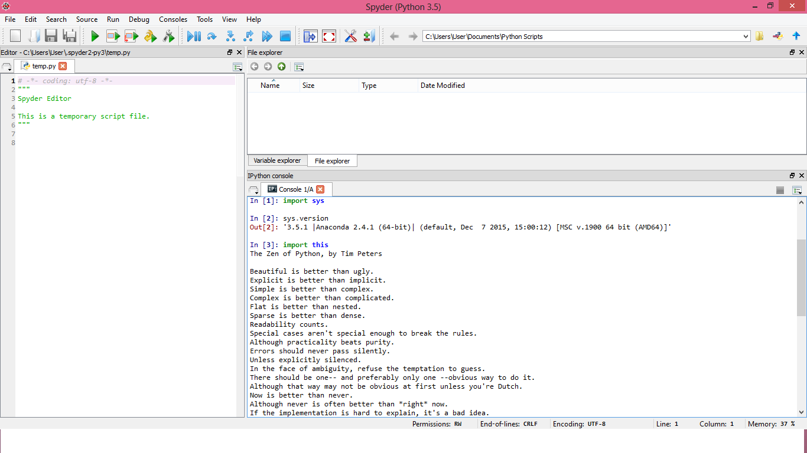

UECM3033 Assignment #1 Report
========================================================

- Prepared by: Lim Mei Kuan
- Tutorial Group: T2

--------------------------------------------------------

## Task 1 -- setup a github repository

The reports, codes and supporting documents are uploaded to Github at: 

[https://github.com/Limmeikuan/UECM3033_assign1](https://github.com/Limmeikuan/UECM3033_assign1)

---------------------------------------------------------

## Task 2 -- setup python

Put here the screen shot of file (python.png)

------------------------------------------------------------

## Task 3 -- modify and run Python script

In this section, please report:

1. The hexadecimal value of your student ID.
	
	Hexadecimal representation of 1306098 is 0x13edf2
	
2. Write down the definite integrals that you have chosen.

	$$\int_0^{\infty} e^{-x^3}* 5x^3 dx = 5*\frac{\gamma{\frac{4}{3}}{3}.$$

3. Write down your system of 10 linear equations.
        \begin{align*}
	3 x_0 +x_1 +4 x_2 +5 x_3 +6 x_4 + 2 x_7 &= 9,\\
	2 x_0 +3 x_2 +2 x_3 +x_4 +x_7 + 2 x_8 &= 8,\\
	4 x_0 +3 x_1 +5 x_2 +4 x_3 +3 x_4 +x_5 +3 x_8 +x_9 &= 8,\\
	3 x_0 +4 x_1 +3 x_2 +5 x_3 +4 x_4 +2 x_5 +2 x_6 &= 3,\\
	x_0 +9 x_1 +3 x_2 +2 x_3 +3 x_4 +x_6 +3 x_7 +3 x_8 &= 2,\\
	x_0 +7 x_1 +5 x_2 +6 x_3 +8 x_4 +9 x_5 +2 x_8 +x_9 &= 1,\\
	3 x_1 +2 x_2 +4 x_3 +5 x_4 +9 x_5 +x_6 +7 x_7 &= 7,\\
	2 x_0 +3 x_3 +4 x_4 +4 x_5 +x_6 +7 x_7 +x_9 &= 2,\\
	4 x_4 +3 x_5 +6 x_7 +3 x_8 +9 x_9 &= 8,\\
	2 x_0 +x_2 +2 x_4 +8 x_6 +9 x_8 +4 x_9 &= 2.
	\end{align*}
	
	Solution =  [-0.78819382 -0.82758473  5.03301183 -1.21021817 -0.71670889 -0.23073485
  		     1.47764052  1.20573155 -1.79561708  1.07905579]

Here are the examples of how to add equations in markdown:

$$\int_0^{\infty} e^{-x^2} dx = \frac{\sqrt{\pi}}{2}.$$

\begin{align*}
3 x_0 +x_1 &= 9,\\
x_0 + 2 x_1 &= 8.
\end{align*}

-----------------------------------

last modified: 27 Jan 2016
